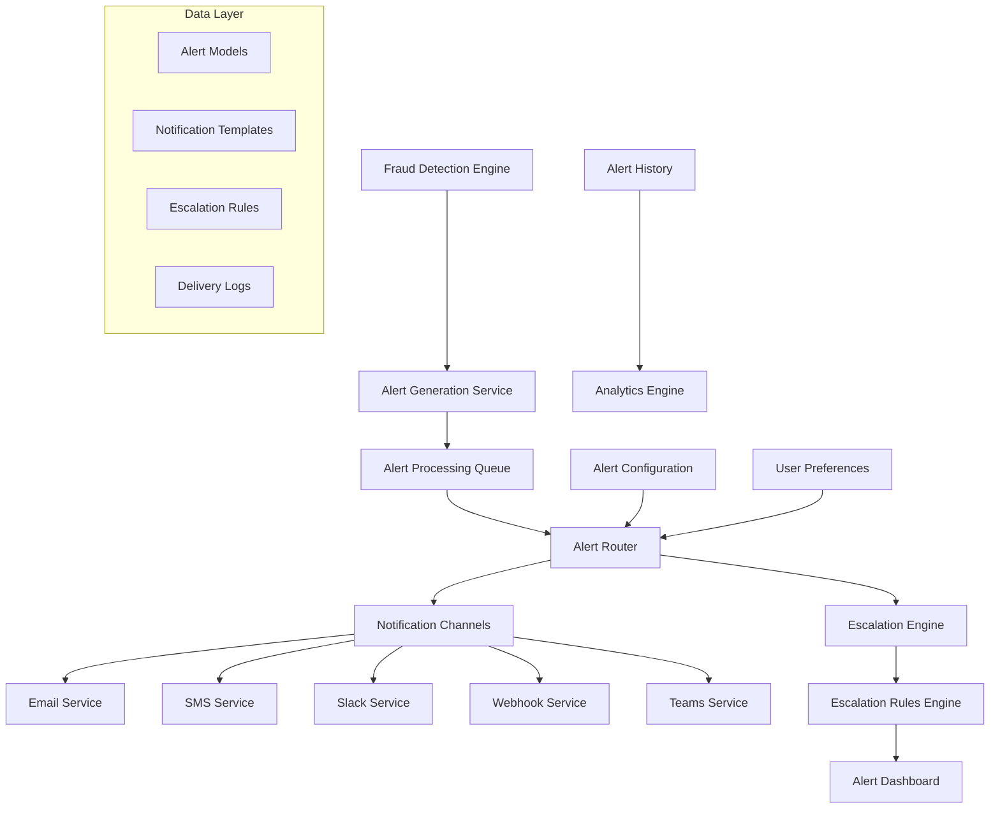
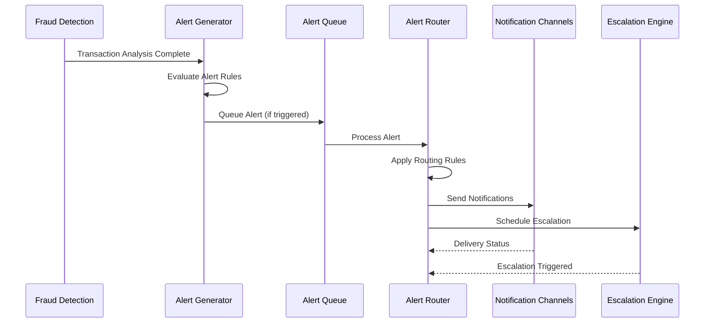

# Design Document

## Overview

The Real-time Fraud Alerting System is designed as an event-driven, scalable notification service that integrates seamlessly with the existing fraud detection pipeline. The system will leverage Django's existing architecture while introducing new components for alert management, multi-channel notifications, and intelligent routing. The design emphasizes real-time performance, reliability, and extensibility to support future notification channels and alert types.

## Architecture

### High-Level Architecture



### Event Flow Architecture



## Components and Interfaces

### 1. Alert Generation Service

**Purpose**: Evaluates fraud detection results against configured alert rules and generates appropriate alerts.

**Key Classes**:
```python
class AlertGenerator:
    def evaluate_transaction(self, transaction: Transaction, fraud_result: FraudResult) -> List[Alert]
    def apply_alert_rules(self, context: AlertContext) -> List[AlertRule]
    def create_alert(self, rule: AlertRule, context: AlertContext) -> Alert
    def consolidate_alerts(self, alerts: List[Alert]) -> List[Alert]

class AlertRule:
    def matches(self, context: AlertContext) -> bool
    def get_severity(self, context: AlertContext) -> AlertSeverity
    def get_channels(self) -> List[NotificationChannel]
```

**Interfaces**:
- `POST /api/v1/alerts/rules/` - Create alert rule
- `GET /api/v1/alerts/rules/` - List alert rules
- `PUT /api/v1/alerts/rules/{id}/` - Update alert rule
- `DELETE /api/v1/alerts/rules/{id}/` - Delete alert rule

### 2. Alert Processing Queue

**Purpose**: Manages alert processing with priority queuing and retry mechanisms.

**Implementation**: Redis-based queue with Celery for background processing.

**Key Features**:
- Priority-based processing (Critical > High > Medium > Low)
- Exponential backoff for failed deliveries
- Dead letter queue for persistent failures
- Rate limiting to prevent notification spam

### 3. Alert Router

**Purpose**: Routes alerts to appropriate notification channels based on configuration and user preferences.

**Key Classes**:
```python
class AlertRouter:
    def route_alert(self, alert: Alert) -> List[NotificationTask]
    def apply_routing_rules(self, alert: Alert) -> List[NotificationChannel]
    def check_rate_limits(self, alert: Alert, channel: NotificationChannel) -> bool
    def schedule_escalation(self, alert: Alert) -> EscalationTask

class RoutingRule:
    def applies_to(self, alert: Alert) -> bool
    def get_channels(self, alert: Alert) -> List[NotificationChannel]
    def get_delay(self, alert: Alert) -> timedelta
```

### 4. Notification Channels

**Purpose**: Handles delivery of notifications through various channels with consistent interface.

**Base Interface**:
```python
class NotificationChannel(ABC):
    @abstractmethod
    async def send(self, notification: Notification) -> DeliveryResult
    
    @abstractmethod
    def validate_config(self, config: Dict) -> bool
    
    @abstractmethod
    def get_delivery_status(self, delivery_id: str) -> DeliveryStatus
```

**Channel Implementations**:
- **EmailChannel**: SMTP/SendGrid integration
- **SMSChannel**: Twilio/AWS SNS integration  
- **SlackChannel**: Slack Web API integration
- **WebhookChannel**: HTTP POST with authentication
- **TeamsChannel**: Microsoft Teams connector

### 5. Escalation Engine

**Purpose**: Manages alert escalation workflows based on acknowledgment timeouts and severity levels.

**Key Classes**:
```python
class EscalationEngine:
    def schedule_escalation(self, alert: Alert) -> None
    def process_escalation(self, escalation_task: EscalationTask) -> None
    def cancel_escalation(self, alert_id: str) -> None
    def get_escalation_path(self, alert: Alert) -> List[EscalationLevel]

class EscalationLevel:
    def get_recipients(self) -> List[User]
    def get_timeout(self) -> timedelta
    def get_channels(self) -> List[NotificationChannel]
```

## Data Models

### Core Alert Models

```python
class Alert(models.Model):
    SEVERITY_CHOICES = [
        ('low', 'Low'),
        ('medium', 'Medium'), 
        ('high', 'High'),
        ('critical', 'Critical'),
    ]
    
    STATUS_CHOICES = [
        ('pending', 'Pending'),
        ('sent', 'Sent'),
        ('acknowledged', 'Acknowledged'),
        ('resolved', 'Resolved'),
        ('escalated', 'Escalated'),
    ]
    
    id = models.UUIDField(primary_key=True, default=uuid.uuid4)
    alert_type = models.CharField(max_length=100)
    severity = models.CharField(max_length=20, choices=SEVERITY_CHOICES)
    status = models.CharField(max_length=20, choices=STATUS_CHOICES, default='pending')
    
    # Context
    transaction = models.ForeignKey(Transaction, on_delete=models.CASCADE)
    fraud_score = models.FloatField()
    risk_factors = models.JSONField()
    
    # Content
    title = models.CharField(max_length=255)
    message = models.TextField()
    context_data = models.JSONField(default=dict)
    
    # Metadata
    rule_triggered = models.ForeignKey('AlertRule', on_delete=models.SET_NULL, null=True)
    owner = models.ForeignKey(User, on_delete=models.CASCADE)
    
    # Timestamps
    created_at = models.DateTimeField(auto_now_add=True)
    acknowledged_at = models.DateTimeField(null=True, blank=True)
    acknowledged_by = models.ForeignKey(User, on_delete=models.SET_NULL, null=True, blank=True, related_name='acknowledged_alerts')
    resolved_at = models.DateTimeField(null=True, blank=True)

class AlertRule(models.Model):
    ACTION_CHOICES = [
        ('alert', 'Generate Alert'),
        ('escalate', 'Immediate Escalation'),
        ('block', 'Block and Alert'),
    ]
    
    id = models.UUIDField(primary_key=True, default=uuid.uuid4)
    name = models.CharField(max_length=255)
    description = models.TextField(blank=True)
    
    # Rule conditions
    conditions = models.JSONField()  # Complex rule conditions
    fraud_score_threshold = models.FloatField(null=True, blank=True)
    amount_threshold = models.DecimalField(max_digits=12, decimal_places=2, null=True, blank=True)
    
    # Alert configuration
    alert_type = models.CharField(max_length=100)
    severity = models.CharField(max_length=20, choices=Alert.SEVERITY_CHOICES)
    action = models.CharField(max_length=20, choices=ACTION_CHOICES)
    
    # Notification settings
    notification_channels = models.JSONField(default=list)
    consolidation_window = models.DurationField(default=timedelta(minutes=10))
    
    # Metadata
    is_active = models.BooleanField(default=True)
    priority = models.IntegerField(default=1)
    owner = models.ForeignKey(User, on_delete=models.CASCADE)
    
    created_at = models.DateTimeField(auto_now_add=True)
    updated_at = models.DateTimeField(auto_now=True)

class NotificationDelivery(models.Model):
    STATUS_CHOICES = [
        ('pending', 'Pending'),
        ('sent', 'Sent'),
        ('delivered', 'Delivered'),
        ('failed', 'Failed'),
        ('retrying', 'Retrying'),
    ]
    
    id = models.UUIDField(primary_key=True, default=uuid.uuid4)
    alert = models.ForeignKey(Alert, on_delete=models.CASCADE, related_name='deliveries')
    
    # Delivery details
    channel_type = models.CharField(max_length=50)
    recipient = models.CharField(max_length=255)
    status = models.CharField(max_length=20, choices=STATUS_CHOICES, default='pending')
    
    # Delivery tracking
    external_id = models.CharField(max_length=255, blank=True)
    attempts = models.IntegerField(default=0)
    last_attempt_at = models.DateTimeField(null=True, blank=True)
    delivered_at = models.DateTimeField(null=True, blank=True)
    
    # Error handling
    error_message = models.TextField(blank=True)
    retry_after = models.DateTimeField(null=True, blank=True)
    
    created_at = models.DateTimeField(auto_now_add=True)
    updated_at = models.DateTimeField(auto_now=True)

class EscalationRule(models.Model):
    id = models.UUIDField(primary_key=True, default=uuid.uuid4)
    name = models.CharField(max_length=255)
    
    # Escalation conditions
    alert_severity = models.CharField(max_length=20, choices=Alert.SEVERITY_CHOICES)
    timeout_minutes = models.IntegerField()
    business_hours_only = models.BooleanField(default=False)
    
    # Escalation path
    escalation_levels = models.JSONField()  # List of escalation levels with recipients
    
    # Metadata
    is_active = models.BooleanField(default=True)
    owner = models.ForeignKey(User, on_delete=models.CASCADE)
    
    created_at = models.DateTimeField(auto_now_add=True)
    updated_at = models.DateTimeField(auto_now=True)
```

### Notification Templates

```python
class NotificationTemplate(models.Model):
    CHANNEL_CHOICES = [
        ('email', 'Email'),
        ('sms', 'SMS'),
        ('slack', 'Slack'),
        ('webhook', 'Webhook'),
        ('teams', 'Microsoft Teams'),
    ]
    
    id = models.UUIDField(primary_key=True, default=uuid.uuid4)
    name = models.CharField(max_length=255)
    channel_type = models.CharField(max_length=20, choices=CHANNEL_CHOICES)
    alert_type = models.CharField(max_length=100)
    
    # Template content
    subject_template = models.CharField(max_length=255, blank=True)
    body_template = models.TextField()
    
    # Template variables and formatting
    variables = models.JSONField(default=dict)
    formatting_options = models.JSONField(default=dict)
    
    # Metadata
    is_default = models.BooleanField(default=False)
    owner = models.ForeignKey(User, on_delete=models.CASCADE)
    
    created_at = models.DateTimeField(auto_now_add=True)
    updated_at = models.DateTimeField(auto_now=True)
```

## Error Handling

### Retry Strategy

```python
class RetryStrategy:
    def __init__(self):
        self.max_retries = 3
        self.base_delay = 60  # seconds
        self.max_delay = 3600  # 1 hour
        self.backoff_multiplier = 2
    
    def get_retry_delay(self, attempt: int) -> int:
        delay = self.base_delay * (self.backoff_multiplier ** attempt)
        return min(delay, self.max_delay)
    
    def should_retry(self, error: Exception, attempt: int) -> bool:
        if attempt >= self.max_retries:
            return False
        
        # Retry on temporary failures
        if isinstance(error, (ConnectionError, TimeoutError, HTTPError)):
            return True
        
        return False
```

### Error Categories

1. **Temporary Failures**: Network issues, service unavailable, rate limits
   - **Action**: Retry with exponential backoff
   - **Max Retries**: 3 attempts

2. **Permanent Failures**: Invalid configuration, authentication errors
   - **Action**: Log error, disable channel, notify admin
   - **Max Retries**: 0

3. **Partial Failures**: Some recipients succeed, others fail
   - **Action**: Retry failed recipients only
   - **Tracking**: Per-recipient delivery status

### Circuit Breaker Pattern

```python
class CircuitBreaker:
    def __init__(self, failure_threshold=5, timeout=300):
        self.failure_threshold = failure_threshold
        self.timeout = timeout
        self.failure_count = 0
        self.last_failure_time = None
        self.state = 'closed'  # closed, open, half-open
    
    def call(self, func, *args, **kwargs):
        if self.state == 'open':
            if time.time() - self.last_failure_time > self.timeout:
                self.state = 'half-open'
            else:
                raise CircuitBreakerOpenError()
        
        try:
            result = func(*args, **kwargs)
            self.on_success()
            return result
        except Exception as e:
            self.on_failure()
            raise e
```

## Testing Strategy

### Unit Testing

1. **Alert Generation Logic**
   - Rule evaluation accuracy
   - Alert consolidation logic
   - Severity calculation

2. **Notification Channels**
   - Message formatting
   - Delivery confirmation
   - Error handling

3. **Escalation Engine**
   - Timeout calculations
   - Escalation path resolution
   - Business hours logic

### Integration Testing

1. **End-to-End Alert Flow**
   - Fraud detection → Alert generation → Notification delivery
   - Multi-channel delivery coordination
   - Escalation workflow execution

2. **External Service Integration**
   - Email service integration (SendGrid/SMTP)
   - SMS service integration (Twilio)
   - Slack/Teams API integration
   - Webhook delivery and authentication

### Performance Testing

1. **Load Testing**
   - Alert generation under high transaction volume
   - Notification delivery throughput
   - Queue processing performance

2. **Stress Testing**
   - System behavior under notification failures
   - Memory usage during alert spikes
   - Database performance with large alert volumes

### Monitoring and Alerting

```python
class AlertingMetrics:
    def __init__(self):
        self.alert_generation_time = Histogram('alert_generation_seconds')
        self.notification_delivery_time = Histogram('notification_delivery_seconds')
        self.delivery_success_rate = Counter('notification_delivery_total')
        self.escalation_triggered = Counter('escalation_triggered_total')
        
    def record_alert_generated(self, processing_time: float):
        self.alert_generation_time.observe(processing_time)
    
    def record_delivery_attempt(self, channel: str, success: bool, duration: float):
        self.notification_delivery_time.labels(channel=channel).observe(duration)
        self.delivery_success_rate.labels(
            channel=channel, 
            status='success' if success else 'failure'
        ).inc()
```

### Health Checks

1. **Service Health**
   - Alert queue processing status
   - Notification channel availability
   - Database connectivity

2. **Business Logic Health**
   - Alert rule evaluation accuracy
   - Delivery success rates by channel
   - Escalation workflow effectiveness

This design provides a robust, scalable foundation for real-time fraud alerting while integrating seamlessly with the existing fraud analytics platform architecture.